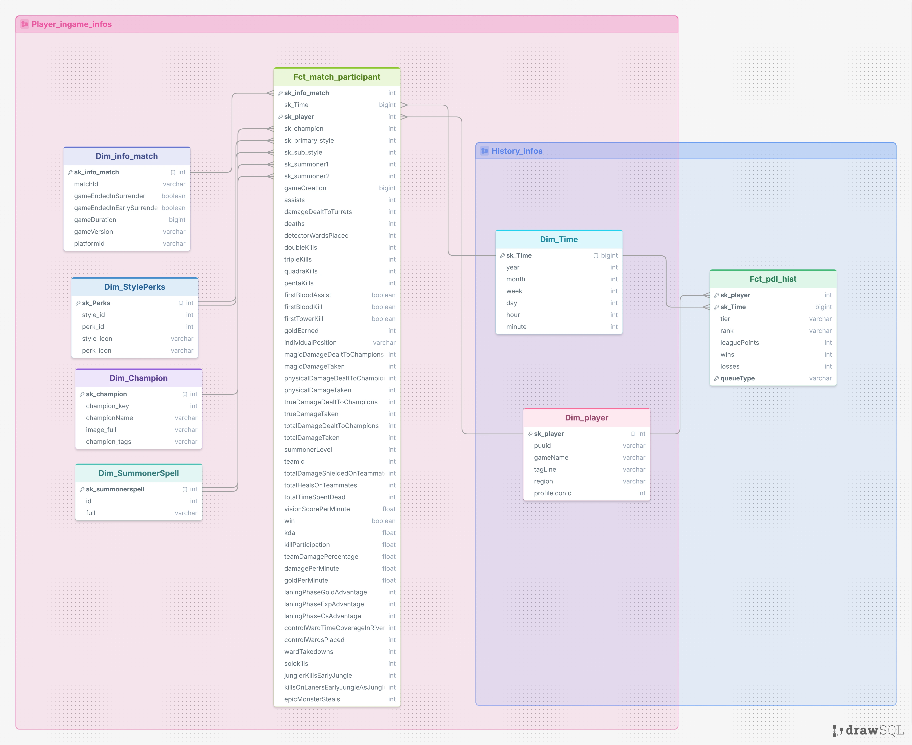

# Definição dos objetivos (metricas)

* Analisar taxa de:
    * **Por partida/campeão/rota**
        * **WinRate**
        * **KDA**
        * **Cs/min**
        * **Vision/min**
        * **N° de barricas**
        * **Antes dos 15'**
            1. **Cs/min**
            2. **Cs difference** 
            3. **Gold difference**
            4. **Xp difference**
            5. **N° of turret plates taken**
        * **Gold per min**
        * **Absolut Damage**
        * **Absolut Gold**
        * **Kill Participation**
        * **Match time duration**
        * **Gold efficience - CPM** 
            * $CPM = \frac{DPM}{GPM}$
        * **Number of**:
            * **Triple kills**
            * **Quadra Kils**
            * **Penta Kills**
            * **Solo Kills**
        
* Valores booleanos se está envolvido no **Firs Blood**:
    * **Participation**

* Acompanhar **ganho/perda de pdl** por jogo.w

* Analisar os tipos de téminos de partidas:
    * ``Surrender``
    * ``Complete``
    * ``Remake``

* Acompanhar todas as metricas por **patches**
    

# Entidades

* `Dim_player`:
    * `sk_player` - Id gerado 
    * `puuid` - Obtido pelo endpoint ``/riot/account/v1/accounts/by-riot-id/{gameName}/{tagLine}``
    * `gameName` - Informação dada pelo jogador
    * `tagLine` - Informação dada pelo jogador
    * `region` - informação dada pelo jogador
    * `profileIconId` - Obtido pelo endpoint ``/lol/summoner/v4/summoners/by-puuid/{encryptedPUUID}``
        * **Isto é apenas o ID**, para pegar a imagem é necessário acessar é preciso, pegar a img do [ddragon](https://ddragon.leagueoflegends.com/cdn/16.14.1/img/profileicon/685.png), com a **URL** no seguinte formato: `https://ddragon.leagueoflegends.com/cdn/{versão_atual}/img/profileicon/{profile_icon_id}.png`

* `Dim_Champion`
    * ``sk_champion`` - id gerado
    * `champion_key` - refirido apenas como `key` no `JSON`, é obtido acessar pelo [ddragon](https://ddragon.leagueoflegends.com/cdn/16.14.1/data/en_US/champion.json), com a **URL** no seguinte formato: `https://ddragon.leagueoflegends.com/cdn/{versão_atual}/data/en_US/champion.json`.
    * `championName` - referido apenas como `name` no `JSON`, tambem obtido pelo `ddragon`.
    * `image_full` - obtido pelo `ddragon`, contem o nome do arquivo para a imagem do campeao
        * `image_champion` - obtido pelo [ddragon](https://ddragon.leagueoflegends.com/cdn/16.14.1/img/champion/Aatrox.png), mas pela **URL** no seguinte formato: `https://ddragon.leagueoflegends.com/cdn/{version}/img/champion/{image.full}`
    * `champion_tags` - referido apenas como `tags` no `JSON`, tambem obtido pelo `ddragon` (devolve uma `list` de tags).
    

* `Dim_info_match` - todos os dados puxados do endpoint `/lol/match/v5/matches/{matchId}`
    * `sk_info_match` - id gerado
    * `matchId` - corresponde ao `Dim_match`
    * `gameEndedInSurrender` - Indica se a partida terminou por surrender.
    * `gameEndedInEarlySurrender` - Indica se a partida terminou em rendição antecipada (Remake).
    * `gameDuration` - Refere a duração do jogo em segundos.
    * `gameVersion` - as $2$ primeiras partes informam o patch em que foi jogado a partida, exemplo: $$V = (v_{\text{major}}, v_{\text{minor}}, v_{\text{build}}, v_{\text{revision}})$$
    $$V = (\text{"16"}, \text{"14"}, \text{"794"}, \text{"9266"})$$
    $$\mathcal{P}(V) = v_{\text{major}} \cdot v_{\text{minor}}$$
    $$\mathcal{P}(\text{"16.14.794.9266"}) = 16.14$$
    * $v_{\text{major}} = 16$: Representa a temporada / ano do jogo (Season 16).
    * $v_{\text{minor}} = 14$: Representa a atualização quinzenal da temporada (Patch 14).
    * `platformId` - servidore em que foi jogado
    * `queueId` - é um **Id** que se refere ao modo jogado, segue a lista de códigos:
        * A lista é obtida pela **URL** [queue](https://static.developer.riotgames.com/docs/lol/queues.json).

* `Dim_StylePerks` 
    * `sk_Perks` - id gerado
    * `style_id` - **Id** da arvores, raiz do objeto no `JSON` 
    * `perk_id` - **Id** da runa individual, dentro de `runes` no `JSON`
    * `style_icon` - raiz do objeto `JSON`, string caminho para a imagem da runa.
        * formato da **URL**: `https://ddragon.leagueoflegends.com/cdn/img/{icon}` 
    * `perk_icon` - dentro de `runes`, string caminho para a imagem da runa.
        * formato da **URL**: `https://ddragon.leagueoflegends.com/cdn/img/{icon}` 

 
* `Dim_SummonerSpell` 
    * `sk_summonerspell`
    * `id` - refirido apenas como `key` no `JSON`, retorna o **id** da SummonerSpell.
    * `full` - Dentro de `image`,string `.png` para formar a **URL** das imagens.
        * A **URL** das imagens estão no seguinte formato `https://ddragon.leagueoflegends.com/cdn/{patch}/img/spell/{full}`

* `Dim_Time`
    * `sk_Time` - id gerado
    * `year`
    * `month`
    * `week`
    * `day`
    * `hour`
    * `minute`

* `Fct_match_participant` - todos os dados puxados do endpoint `/lol/match/v5/matches/{matchId}`
    * `sk_info_match` - id gerado por `Dim_info_match`.
    * `sk_Time`
    * `sk_player`
    * `sk_champion`
    * `sk_primary_style`
    * `sk_sub_style`
    * `sk_summoner1`
    * `sk_summoner2`
    * `gameCreation` - hórario que o jogo foi criado. 
    * `assists` - N° de assistência do jogador na partida.
    * `damageDealtToTurrets` - Dano causado a torres.
    * `deaths` - N° de mortes do jogador
    * `detectorWardsPlaced` - N° de 'pinks' colocads.
    * `doubleKills` - N° de doublekills.
    * `quadraKills` - N° de quadrakills.
    * `tripleKills` - N° de triplekills.
    * `pentaKills`- N° de pentakills.
    * `firstBloodAssist` - Assistencia no first Blood.
    * `firstBloodKill` - Participou no first Blood.
    * `firstTowerKill` - Levou a primeira torre.
    * `goldEarned` - Quanto de gold o jogador ganhou na partida
    * `individualPosition` - Posição do jogador
        * Os nomes possíveis são: `[TOP,JUNGLE,MIDDLE,BOTTOM,UTILITY]`
    * `magicDamageDealtToChampions` - refere a quantidade de dano magico causado a campeões.
    * `magicDamageTaken` - refere a quantidade de dano magico sofrido de campeões.
    * `physicalDamageDealtToChampions` - refere a quantidade de dano fisico causado a campeões.
    * `physicalDamageTaken` - refere a quantidade de dano verdadeiro sofrido de campeões.
    * `trueDamageDealtToChampions` -
    * `trueDamageTaken` - refere a quantidade de dano verdadeiro sofrido de campeões.
    * `totalDamageDealtToChampions` - Total de dano causado a campões.
    * `totalDamageTaken` - Total de dano sofrido de campões.
    * `summonerLevel` - Level no momento da partida do jogador.
    * `teamId` - **id** que diz quais jogadores estão no mesmo time, $100 = BlueTeam$ e $200 = Red Team$
    * `totalDamageShieldedOnTeammates` - todo o dano mitigado por escudo em aliados.
    * `totalHealsOnTeammates` - toda a cura efetiva em aliados.
    * `totalTimeSpentDead` - O tempo total morto.
    * `visionScorePerMinute` - Escore de visão $$\frac{\text{wardsPostas} + \text{retiradas}}{\text{minute}}$$
    * `win` - se o jogador venceu ou não
    * `kda` - Retorna o KDA do jogador $$\text{KDA} = \frac{\text{Kills} + \text{Assists}}{\text{Deaths}}$$ 
        * Quando $\text{Deaths} = 0$ será considerado $\text{Deaths} = 1$ 
    * `killParticipation` - % de participação nos abates do time
    * `teamDamagePercentage` - Porcentagem do dano total da equipe que saiu deste jogador.
    * `damagePerMinute` - (DPM): Dano causado por minuto
    * `goldPerMinute` - (GPM): Taxa de acúmulo de ouro por minuto.
    * `laningPhaseGoldAdvantage` - Vantagem de ouro  que o jogador acumulou durante a fase de rotas (até os 15 minutos).
    * `laningPhaseExpAdvantage` - Vantagem de XP que o jogador acumulou durante a fase de rotas (até os 15 minutos).
    * `laningPhaseCsAdvantage` - Vantagem de farm que o jogador acumulou durante a fase de rotas (até os 15 minutos).
        * Todos os 3 são obitidos pelo endpoint `/lol/match/v5/matches/{matchId}/timeline`
    * `controlWardTimeCoverageInRiverOrEnemyHalf` - Porcentagem de tempo em que as Pink Wards do jogador cobriram o rio ou a selva inimiga.
    * `controlWardsPlaced` - quantidade wards de controle (pinks) colocadas.
    * `wardTakedowns` - quantidade de wards destruidas.
    * `solokills` - Quantidade de abates $1\text{v}1$ (solokills). 
    * `junglerKillsEarlyJungle` - Abates efetuados na selva no início do jogo.
    * `killsOnLanersEarlyJungleAsJungler` - Ganks bem-sucedidos no início da partida.
    * `epicMonsterSteals` - Quantidade de Dragões, Barões ou Arautos roubados.

 * `Fct_pdl_hist` - Todos os dados do endpoint `/lol/league/v4/entries/by-puuid/{encryptedPUUID}`
    * `sk_player`
    * `sk_Time`
    * `tier` 
    * `rank`  
    * `leaguePoints`
    * `wins`
    * `losses`  
    * `queueType`

# Modelagem de dados Final 

